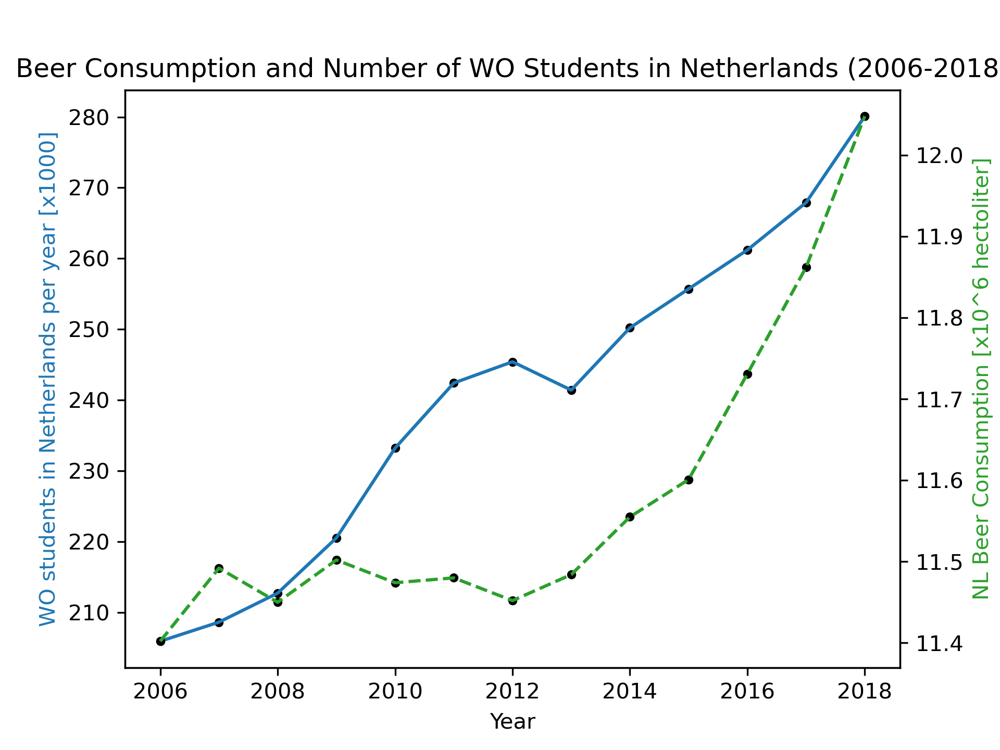

# Titles

- ‘Fantastic Yeasts and Where to Find Them: The Hidden Diversity of Dimorphic Fungal Pathogens’

- ‘An Analysis of the Forces Required to Drag Sheep over Various Surfaces’

- ‘Correlation of Continuous Cardiac Output Measured by a Pulmonary Artery Catheter Versus Impedance Cardiography in Ventilated Patients’
  
# Data Plot and Interpretation

The chart indicates that from 2006 to 2013, beer consumption in the Netherlands remained relatively stable, fluctuating between 11.4 - 11.5 million hectoliters.

However, from 2014 to the latest data in 2018, there has been an exponential increase, with beer consumption reaching a maximum of over 12 million hectoliters in 2018.

The blue line, based on an assumption of what the data possibly represents, is interpeted as the number of WO students in Netherlands per year (stands for 'wetenschappelijk onderwijs' which translates to 'scientific education'). The graph indicates a consistent upward trend, indicating nearly consistent growth in the number of students enrolled in the Scientific Education field, in the Netherland.
